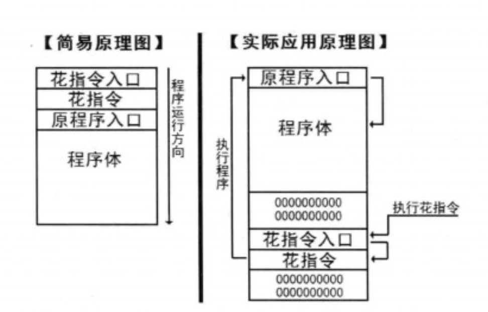
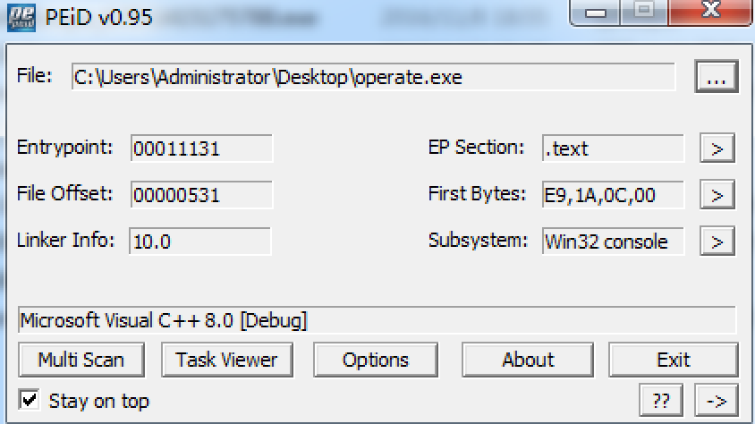
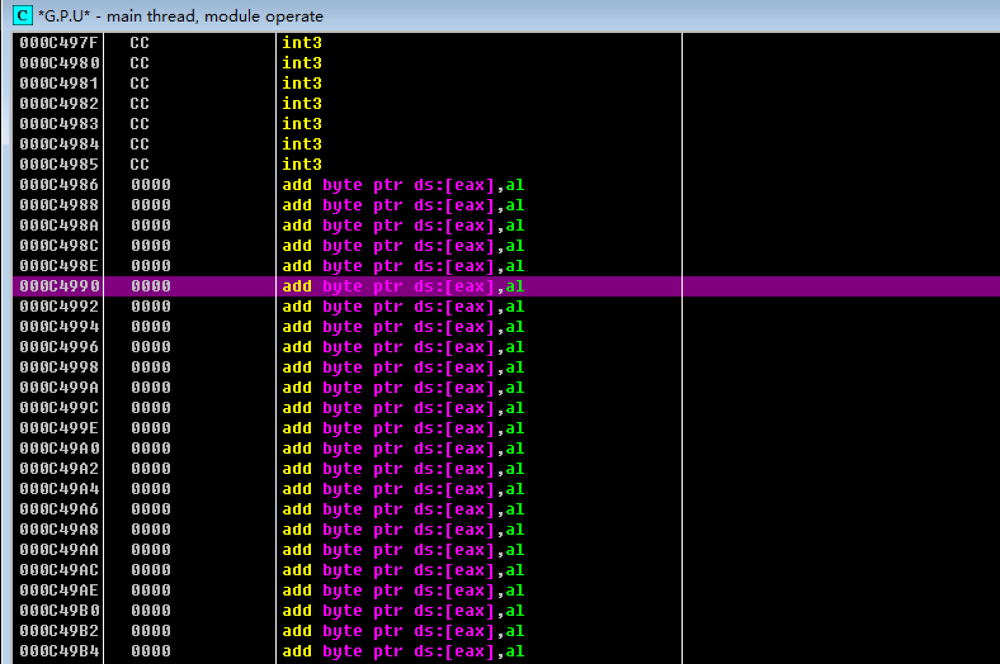
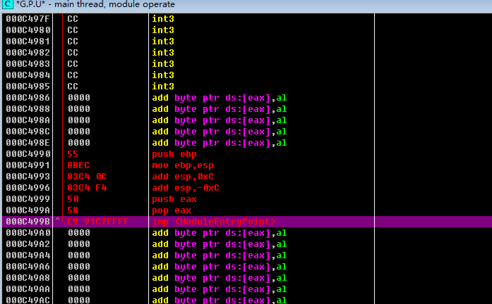
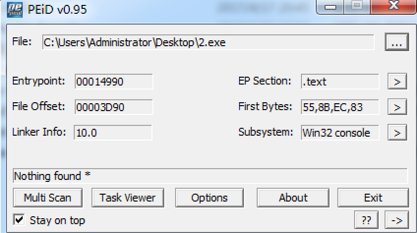

# coding Junk Code  

-------------------------------------  

### 0x00 前言  
花指令是源于汇编的一种技术，程序员为了避免他人进行反汇编分析，偷取程序的中的技术，于是就采用一些干扰指令来对自己的程序进行类似加密的操作。而这种操作使用的代码就叫做“花指令”。  

本文介绍一些花指令的利用方式。

### 0x01 花指令介绍
花指令是一段本可以不存在的指令，它没有实际功能，唯一的目的就是掩盖程序中的一些东西。比如编写木马程序时，间接的调用一些比较敏感的函数；向反汇编的木马中加一些完全不需要的跳转，然后再跳转回去；或者在脚本木马中添加一个打印空字符串的句子；嵌套一个空的if语句。  

花指令可以增加逆向分析者对软件的分析难度；也可以修改掉自身的特征码，躲避杀毒软件；也可以导致反汇编软件不能得到正常的反汇编代码。  

错误的反汇编结果会造成破解者的分析工作大量增加，进而使之不能理解程序的结构和算法，也就很难破解程序，从而达到病毒或软件保护的目的。

### 0x02 花指令利用方式  
__可执行的花指令__   
可执行式花指令指的是能够正常运行的但又不改变原始程序逻辑性的一组无用指令。这类花指令有如下特点：

1. 可以正常运行
2. 不改变任何寄存器的值，堆栈平衡
3. 反汇编器可以正确反汇编该指令

##### 1.修改程序入口点  
修改程序入口点，可以伪装为不同的程序；比如将一个在VC6.0++编译的程序，通过修改程序入口点，变成一个VB编译的程序。  

利用方式：  

1. 使用反编译软件，在程序中找到一段空白的区域 0x0000的位置，准备一段花指令，对寄存器和栈做一些无用的操作（add eax, 0xc; add eax, -0xc），最后使用 jmp 跳到程序本来的入口点，将花指令写入到这个段。
2. 通过 PE 文件编辑器，将程序入口点修改到花指令的第一条的位置。

执行图：  

##### 2.修改特殊字符串或API  
逆向分析工作人员通常在分析过程中，通过寻找特殊的提示型字符串或者特别的API函数就可以在短时间内获取到大量的信息，更清晰的理解分析程序的流程。

所以，可以对特殊字符串和API函数进行加密处理，避免反汇编时直接被暴露出来。

一段程序的反汇编：  

	#include <Windows.h>

	int main() {
	
		MessageBox(NULL, "Test", "Box", 0);
		return 0;
	}

	Disassemble:	
	002B7220  |.  6A 00         push 0x0                                 ; /Style = MB_OK|MB_APPLMODAL
	002B7222  |.  68 741C3000   push 00301C74                            ; |Box
	002B7227  |.  68 6C1C3000   push 00301C6C                            ; |Test
	002B722C  |.  6A 00         push 0x0                                 ; |hOwner = NULL
	002B722E  |.  FF15 D4433100 call dword ptr ds:[<&USER32.MessageBoxA>>; \MessageBoxA

字符串直接就暴露出来了。
	
###### 修改特殊字符串或API的一些思路：

1. 字符串拼接
		
		char *str1 = "Hello";
		char *str2 = "World";
		char *str3 = NULL;
		
		str3 = (char*)malloc(sizeof(strlen(str1) + strlen(str2) + 1));
		strcpy(str3, str1);
		strcat(str3, str2);

2. 字符串隐藏

		char str[] = {'H','e','l','l','o','\0'};

3. 字符串加密

		char MsgBoxA[]={0x5c,0x74,0x62,0x62,0x70,0x76,0x74,0x53,0x7e,0x69,0x50,0x00};//string "MessageBoxA" encode.
		
		//decode

		int len = strlen(MsgBoxA);
		//"MessageBoxA"
		for(int i = 0;i < len; i++)  
			MsgBoxA[i]^=0x11;

##### 3.利用jmp打乱程序结构  
利用jmp打乱本来顺序的代码结构，比如本来的汇编执行代码是这样的语句段：

	statement1;		//语句段1
	statement2;
	statement3;

利用jmp打乱： 

	jmp Label1;
	jmp Label2;
	jmp Label3;
	Label3:
		statement3;
	Label1:
		statement1;
	Label2:
		statement2;

程序的执行顺序没有发生改变，但汇编代码的顺序改变了。		

__不可执行的花指令__  
不可执行的花指令是指被插入到原始代码中但又不改变原始程序逻辑性的一组无用字节。这类花指令有如下特点：

1. 不可以正常运行
2. 反汇编器可能会错误反汇编这些字节

根据反汇编的工作原理，只有当花指令同正常指令的开始几个字节被反汇编器识别成一条指令时，才能有效破坏反汇编的结果。因此，插入的花指令应当是一些不完整的指令，被插入的不完整指令可以是随机选择的。正因为不可执行花指令有这些特点，该类花指令才能应用到软件保护中。 
  
为了能够有效“迷惑"静态反汇编工具，同时保证代码的正确运行，花指令必须满足两个基本特征，即：

1. 垃圾数据必须是某个合法指令的一部分：
2. 程序运行时，花指令必须位于实际不可执行的代码路径。

当前静态分析中采用的反汇编算法主要可以分为2类：线性扫描算法与行进递归算法。

1. 线性扫描反汇编算法  
线性扫描算法p1从程序的入口点开始反汇编，然后对整个代码段进行扫描，反汇编扫描过程中所遇到的每条指令。线性扫描算法的缺点在于在冯诺依曼体系结构下，无法区分数据与代码，从而导致将代码段中嵌入的数据误解释为指令的操作码，以致最后得到错误的反汇编结果。
2. 行进递归反拒绾算法  
相比线性扫描算法，行进递归算法通过程序的控制流来确定反汇编的下一条指令，遇到非控制转移指令时顺序进行反汇编，而遇到控制转移指令时则从转移地址处开始进行反汇编。行进递归算法的缺点在于准确确定间接转移目的地址的难度较大。

For example: 

	jmp Label1
	db 0e8h		;垃圾数据
	Label1:
	.......		;恶意代码
由于0e8h是call指令的操作码，因此对0e8h进行解码时就会将它后面的4个字节，也就是maliciouscode(恶意代码)的前4个字节看作是调用目标地址，从而造成反汇编过程中的错误，达到隐藏恶意代码的目的。	

### 0x03 简单修改程序入口点
按照上面的思路，这里的一个Test.exe的测试文件，经过VS2010编译的C程序。

1.先通过PEID查看程序入口点：  

通过PEID我们看到这个程序是通过Microsoft Visual C++8.0 Debug编译的。  
入口点 Entrypoint:00011131，（这里的入口点是在二进制文件中的文件偏移，在VC编译的情况下，加载到内存中的位置是：文件偏移 + 0x00400000;)

2.通过反汇编软件OD找到一段可以写入的位置：  

然后在这里写入一些花指令，最后jmp到原程序的入口点：  

	push ebp
	mov esp, ebp
	add esp, 0xc
	add esp, -0xc
	push eax
	jmp 0x000C1131
	
(这里的 0x000C1131 是OD加载程序后的程序入口点，每一次加载会不一样)

在OD中在代码段右键-Assemble，进行添加指令：  

3.花指令添加完毕后，将改动保存到二进制文件中：  
选中刚才添加的代码后，在代码段的位置右键-Copy to execute - Selection，在弹出的新窗口右键-Save file,保存成一个新的可执行文件。

4.现在我们需要将新的可执行文件的程序入口点修改为花指令的入口点：  
程序入口点在内存中的地址为： 0x000C1131，程序入口点的文件偏移为： 0x00011131；  
花指令的起始内存地址为： 0x000C4990，则花指令入口的文件偏移为：  (0x000C4990 - 0x000C1131 + 0x00011131) = 0x00014990  

使用PE文件编辑器，比如LordPE修改程序入口点为 0x00014990。  

修改后的效果：  

发现已经成功修改了程序的入口点，并且程序本身的功能也可以正常的运行。

__附:__
实际使用中，可以找一些编译程序的入口汇编代码，用于花指令，可以增加反汇编工作人员的分析难度。

 

------------------------------------  
References:  
《黑客免杀攻防》  
《终级免杀》(黑客x档案)  
看雪：  <http://bbs.pediy.com/thread-129526.htm>   
CSDN.闲云野鹤专栏： <http://blog.csdn.net/cuijinquan/article/details/18408053>  

Author: xx  
Time: 2017.4.20