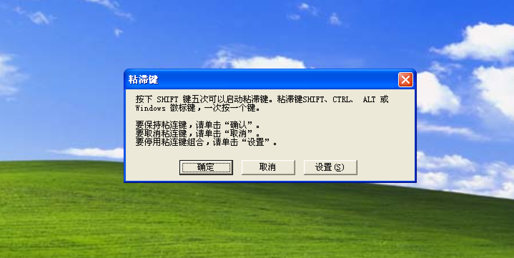

#Shift Backdoor  

###0x00 shift后门的存在  

（本文中的内容测试环境为 windows xp sp3）  
在windows系统下，默认是打开粘连键的，就是连续点击5次 shift 键弹出来的框：  

  

这样的一个东东，这个东西存放在： xp 环境下 `C:\WINDOWS\system32\sethc.exe`  windows7 环境下 `C:\WINDOWS\system32\setchx.exe`  

由这个文件可以用任意文件替换，再点击5次 shift 来触发，就可以打开替换后的文件了，除此之外，粘连键在 windows 的登录界面也是可以触发的，所以通过 explore.exe 替换就可以打开我的电脑了，哈哈。。。。。。。。。。
 

###0x01 shift后门的利用  
__替换成 cmd.exe 后在登录界面触发的效果__  
（cmd.exe 在  `C:\WINDOWS\system32\cmd.exe` ）  

  

既然还没登陆系统都拿到 shell 了，那就可以为自己建一个用户再登陆了：   
新建用户：  `net user test pwd /add`  
提升为管理员:   `net localgroup Administrators test /add`  
激活用户：    `net user test /active:yes`  

(PS:以上操作可能会被防火墙拦截)

__替换成 explore.exe 后在登陆界面触发的效果__  

  

__替换成任意执行文件__  
替换后只需要点5次 shift 后就可以触发执行你放上去的文件了。可以放个木马了，通过shift触发。  

  

-------------------------------------------  
参考资料：  

 
Time: 2016.10