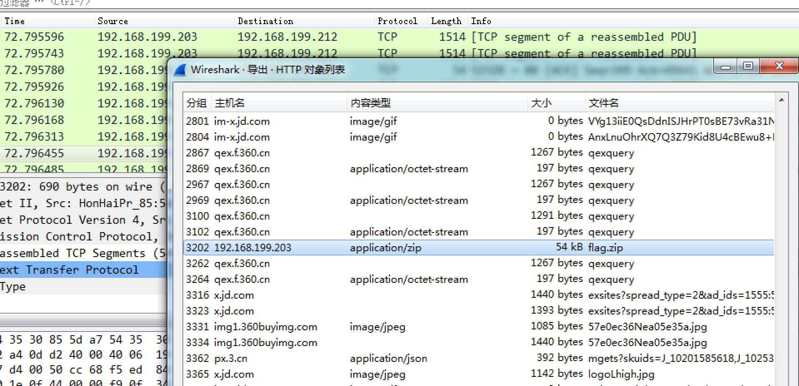
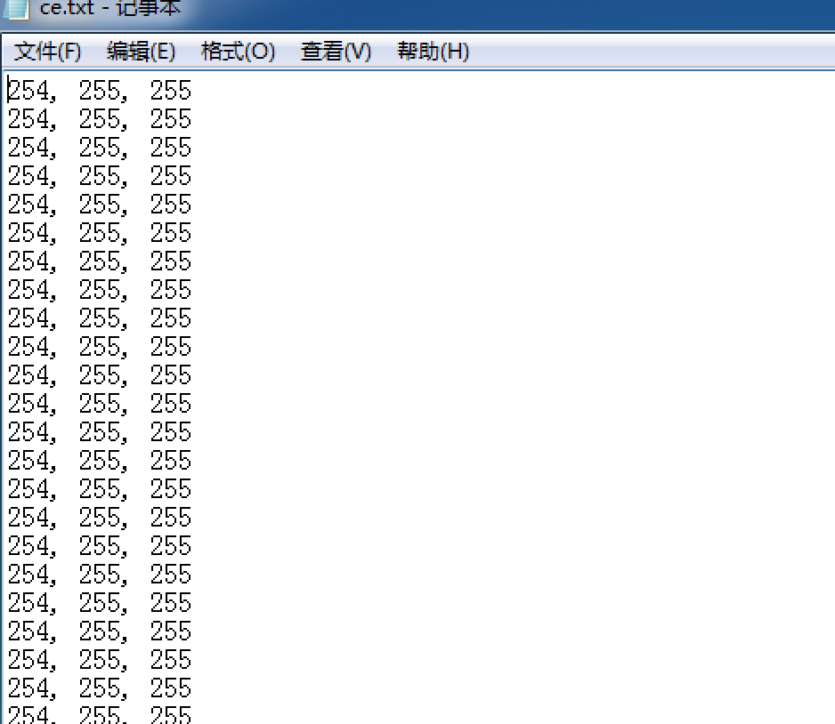

#Python RGB to picture

-------------------------

###0x00 简介  
在一次 CTF 的 MISC 中，遇到的一道题。

###0x01 正文  
题目给的是一个数据包.pacpng 的文件，通过 wiresharke 导出 HTTP对象 后得到一个压缩文件：   

解压文件得到 txt 文件，打开一看，应该是 RGB 了：

利用 python image 模块解一下：  

	from PIL import Image
 
	x=887 # long
	y=111 # width
 
	f = open("ce.txt", 'r')
	rgbinfo = f.readlines()
	f.close()
	c = Image.new("RGB", (x, y))
 
	for i in range(0, x):
    	for j in range(0, y):
        	rgb = rgbinfo[i * y + j].split(", ")
	       c.putpixel([i, j],(int(rgb[0]), int(rgb[1]), int(rgb[2])))
 
	c.show()

Result:  

 

-----------------------
References:  

 
Author: xx  
Time: 2016.11.9