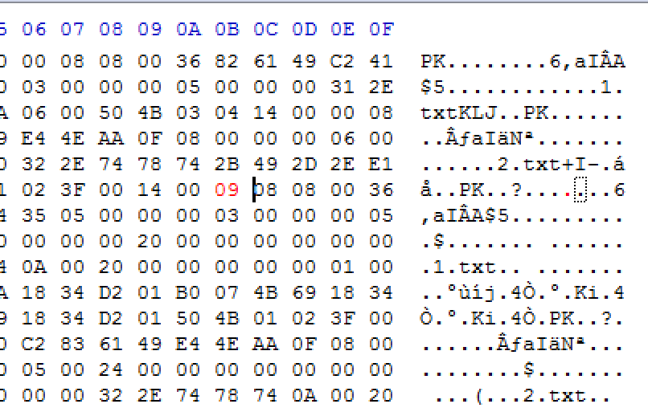

#Zip 伪加密  

--------------------------------

###0x00 简介  
在 CTF 中遇到的一道题： 解压一个 zip 的压缩包即可得到 flag， 但是根本找不到密码， 后来看了 WriteUp 学习到新技能；实际上是修改了 zip 二进制文件的加密标志位，修改回去后就可以直接解压了。  

>下面内容，提前了解 Zip 文件结构

###0x01 正文  
使用 16进制 查看文件结构：  
找到压缩源文件目录区：   
50 4B 01 02：目录中文件文件头标记(0x02014b50)   
1F 00：压缩使用的 pkware 版本   
14 00：解压文件所需 pkware 版本   
00 00：全局方式位标记（有无加密，这个更改这里进行伪加密，改为09 00打开就会提示有密码了）   
08 00：压缩方式   
07 76：最后修改文件时间   
F2 48：最后修改文件日期   

Modify:  

  

Result:  

 

--------------------------------
References:  
CSDN.啊哦的博客： <http://blog.csdn.net/ETF6996/article/details/51946250>

 
Author: xx  
Time: 2016.11.1