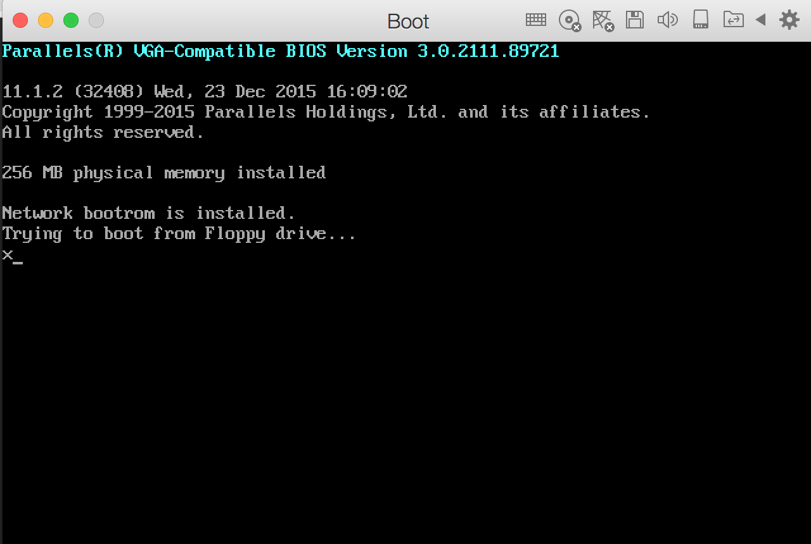

# Make Floppy boot image  
--------------------------------  

### 0x00 前言  
制作一个软盘启动镜像，里面包含一个 MBR 。让 BIOS 执行完后执行 MBR 内的引导程序。

### 0x01 正文  
汇编写的一段程序： 

	mov ah,0xe   ;将16进制数0xe存入寄存器ah
	mov al,'x'       ;将字符x的asc码存入寄存器al
	int 0x10          ;中断，此时若ah的值为0xe，则将寄存器al里的字符输出在显示器上
	end:
	jmp end
	times 0200h - 2 - ($ - $$)  db 0    ;此处给填充若干个0，目的使最终的二进制程序凑够512字节
	dw 0AA55h; MBR程序规定的最后的两个字节

使用 NASM 编译成二进制文件：

	nasm mbrTest.asm -o test.bin
	
使用 dd 命令制作软盘映像文件：  

1. 先制作一个空的软盘映像文件disk.img：

		$ dd if=/dev/zero of=disk.img bs=512 count=2880
		
		2880+0 records in
		2880+0 records out
		1474560 bytes transferred in 0.006561 secs (224744827 bytes/sec)
	
2. 制作一个包含test.bin的映像文件test.img:

		$ dd if=test.bin of=test.img bs=512 count=1

		1+0 records in
		1+0 records out
		512 bytes transferred in 0.000047 secs (10900932 bytes/sec)
		
3. 将disk.img中1个扇区后面的数据拷贝到test.img的后面:  

		$ dd if=disk.img of=test.img skip=1 seek=1 bs=512 count=2879

		2879+0 records in
		2879+0 records out
		1474048 bytes transferred in 0.007852 secs (187732834 bytes/sec)

这样就做成了一个大小为1.44Mb的包含引导代码的映像文件boot.img。

使用 test.img 作为虚拟机的软盘镜像开始启动：  

  

---------------------------------  
References:  
推酷： <http://www.tuicool.com/articles/NRrQnqA>  

 
Author: xx  
Time: 2016.1.12  