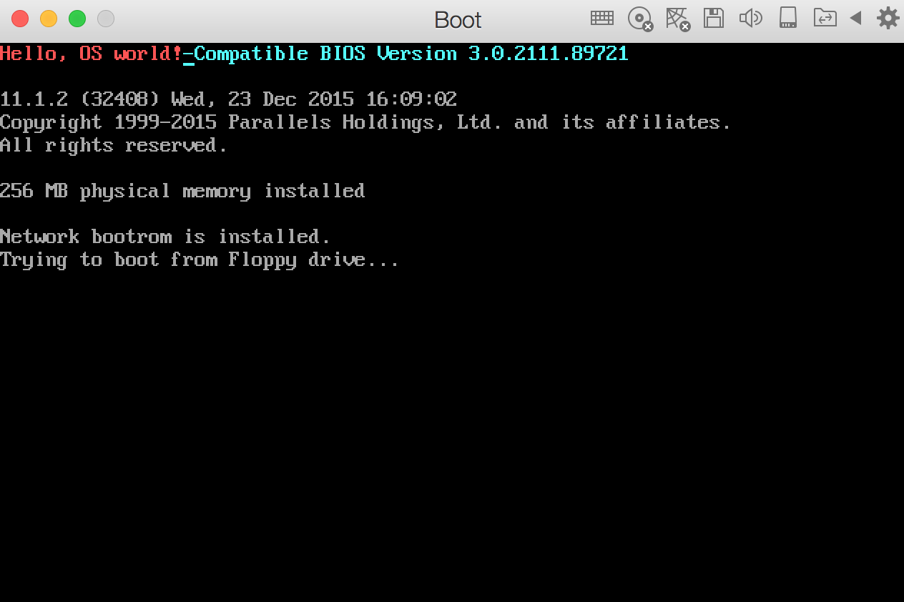

# Operating System 'HelloWorld'  
-----------------------------  

### 0x00 前言  
介绍操作系统的加载过程，和如何运行一个最简单的操作系统-- HelloWorld

### 0x01 操作系统的加载过程  
__第一阶段. BIOS阶段__  
BIOS 芯片里的程序叫做”基本输出输入系统”（Basic Input/Output System）

##### 1.1 硬件自检  
BIOS中主要存放的程序包括：自诊断程序（通过读取CMOS RAM中的内容识别硬件配置，并对其进行自检和初始化）、CMOS设置程序（引导过程中，通过特殊热键启动，进行设置后，存入CMOS RAM中）、系统自动装载程序（在系统自检成功后，将磁盘相对0道0扇区上的引导程序装入内存使其运行）和主要I/O驱动程序和中断服务（BIOS和硬件直接打交道，需要加载I/O驱动程序）。

BIOS程序首先检查，计算机硬件能否满足运行的基本条件，这叫做”硬件自检”（Power-On Self-Test），缩写为POST。

如果硬件出现问题，主板会发出不同含义的蜂鸣，启动中止。如果没有问题，屏幕就会显示出CPU、内存、硬盘等信息。
##### 1.2 启动顺序  
硬件自检完成后，BIOS把控制权转交给下一阶段的启动程序。

这时，BIOS需要知道，”下一阶段的启动程序”具体存放在哪一个设备。也就是说，BIOS需要有一个外部储存设备的排序，排在前面的设备就是优先转交控制权的设备。这种排序叫做”启动顺序”（Boot Sequence）。

__第二阶段. 主引导记录__  
BIOS按照”启动顺序”，把控制权转交给排在第一位的储存设备。即根据用户指定的引导顺序从软盘、硬盘或是可移动设备中读取启动设备的MBR，并放入指定的位置（0x7c000）内存中。

这时，计算机读取该设备的第一个扇区，也就是读取最前面的512个字节。如果这512个字节的最后两个字节是0x55和0xAA，表明这个设备可以用于启动；如果不是，表明设备不能用于启动，控制权于是被转交给”启动顺序”中的下一个设备。

这最前面的512个字节，就叫做”主引导记录”（Master boot record，缩写为MBR）。

__第三阶段. 硬盘启动__  
这时，计算机的控制权就要转交给硬盘的某个分区了，这里又分成三种情况。

##### 3.1 情况A：卷引导记录

上一节提到，四个主分区里面，只有一个是激活的。计算机会读取激活分区的第一个扇区，叫做”卷引导记录”（Volume boot record，缩写为VBR）。

“卷引导记录”的主要作用是，告诉计算机，操作系统在这个分区里的位置。然后，计算机就会加载操作系统了。

##### 3.2 情况B：扩展分区和逻辑分区

随着硬盘越来越大，四个主分区已经不够了，需要更多的分区。但是，分区表只有四项，因此规定有且仅有一个区可以被定义成”扩展分区”（Extended partition）。

所谓”扩展分区”，就是指这个区里面又分成多个区。这种分区里面的分区，就叫做”逻辑分区”（logical partition）。

计算机先读取扩展分区的第一个扇区，叫做”扩展引导记录”（Extended boot record，缩写为EBR）。它里面也包含一张64字节的分区表，但是最多只有两项（也就是两个逻辑分区）。

计算机接着读取第二个逻辑分区的第一个扇区，再从里面的分区表中找到第三个逻辑分区的位置，以此类推，直到某个逻辑分区的分区表只包含它自身为止（即只有一个分区项）。因此，扩展分区可以包含无数个逻辑分区。

但是，似乎很少通过这种方式启动操作系统。如果操作系统确实安装在扩展分区，一般采用下一种方式启动。

##### 3.3 情况C：启动管理器

在这种情况下，计算机读取”主引导记录”前面446字节的机器码之后，不再把控制权转交给某一个分区，而是运行事先安装的”启动管理器”（boot loader），由用户选择启动哪一个操作系统。

Linux环境中，目前最流行的启动管理器是Grub。

对于grub而言，在MBR中的446字节的引导程序属于GRUB的开始执行程序，通过这段程序，进一步执行stage1.5或是stage2的执行程序，将在下面详细介绍执行过程。

其中stage1.5或是stage2便属于阶段2引导的过程了，stage2过程也是作为GRUB kernel的核心代码出现。Stage1.5过程（对于GRUB而言存在stage1.5，GRUB2则不存在）的功能很单一，主要就是为了引导stage2过程服务。由于stage2过程的代码存放在文件系统下的boot分区目录中，因此stage1.5过程就是需要提供一个文件系统的环境，而该文件系统环境需要保证系统可以找到stage2过程的文件，那么stage1.5阶段提供的文件系统需要是boot文件系统所对应的，这个在执行grub install过程中就已经确定了。stage2过程中，主要会把系统切换到保护模式，设置好C运行时环境，找到config文件（事实上就是menulist文件），如果没有找到就执行一个shell，等待用户的执行。然后的工作就变成了输入命令->解析命令->执行命令的循环中。当然该阶段引导的最终状态就是执行boot命令，将内核和initrd镜像加载进入内存中，进而将控制权转交给内核。

__第四阶段. 操作系统__  
控制权转交给操作系统后，操作系统的内核首先被载入内存。

以Linux系统为例，先载入/boot目录下面的kernel。内核加载成功后，第一个运行的程序是/sbin/init。它根据配置文件（Debian系统是/etc/initab）产生init进程。这是Linux启动后的第一个进程，pid进程编号为1，其他进程都是它的后代。

然后，init线程加载系统的各个模块，比如窗口程序和网络程序，直至执行/bin/login程序，跳出登录界面，等待用户输入用户名和密码。

至此，全部启动过程完成。

### 0x02 MBR引导程序  

	org 7c00h;告诉编译器程序加载到7c00处  
	mov ax, cs  
	mov ds, ax  
	mov es, ax  
	call DispStr    ; 调用显示字符串例程  
	jmp $  		   ; 无限循环

	DispStr:  		; 设置 int 10 中断显示
	mov ax, BootMessage  
	mov bp, ax  		; ES:BP = 串地址
	mov cx, 16  		; CX = 串长度
	mov ax, 01301h  	; AH = 13, AL = 01
	mov bx, 00ch  	; 页号为0(BH=00)，黑底红字(BL=0Ch，高亮)
	mov dl, 0  
	int 10h  			; 10h 中断
	ret  

	BootMessage db "Hello, OS world!"  
	times 510-($-$$) db 0   ; 填充剩下的空间，使生成的二进制代码敲好为512字节
	dw 0xaa55  		; 结束标志

使用 NASM 进行编译：  

	nasm helloWorld.asm -o boot.bin	
	
制作一个空的软盘映像文件disk.img：

	dd if=/dev/zero of=disk.img bs=512 count=2880
	
制作一个包含boot.bin的映像文件boot.img:  

	dd if=boot.bin of=boot.img bs=512 count=1

将disk.img中1个扇区后面的数据拷贝到boot.img的后面:

	dd if=disk.img of=boot.img skip=1 seek=1 bs=512 count=2879
	
软盘启动镜像做好了后，加载到虚拟机中开机启动：  

	

   

---------------------------   
References:  
CSDN.Langeldep的专栏:  <http://blog.csdn.net/langeldep/article/details/8788119>  
《ORANGE's: 一个操作系统的实现》
   
Author: xx  
Time: 2017.1.16