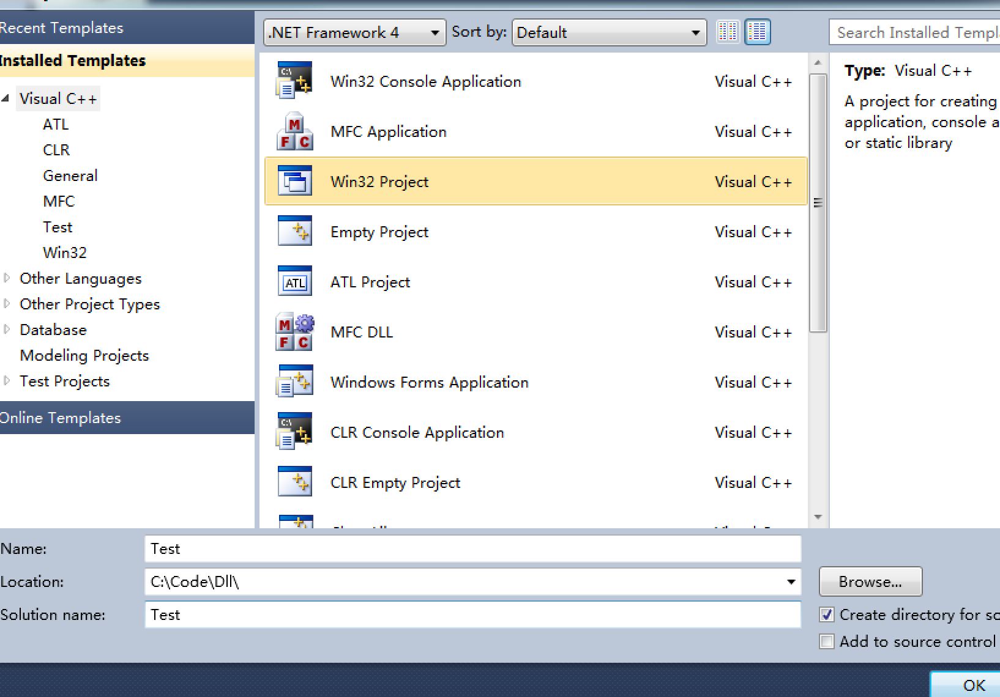
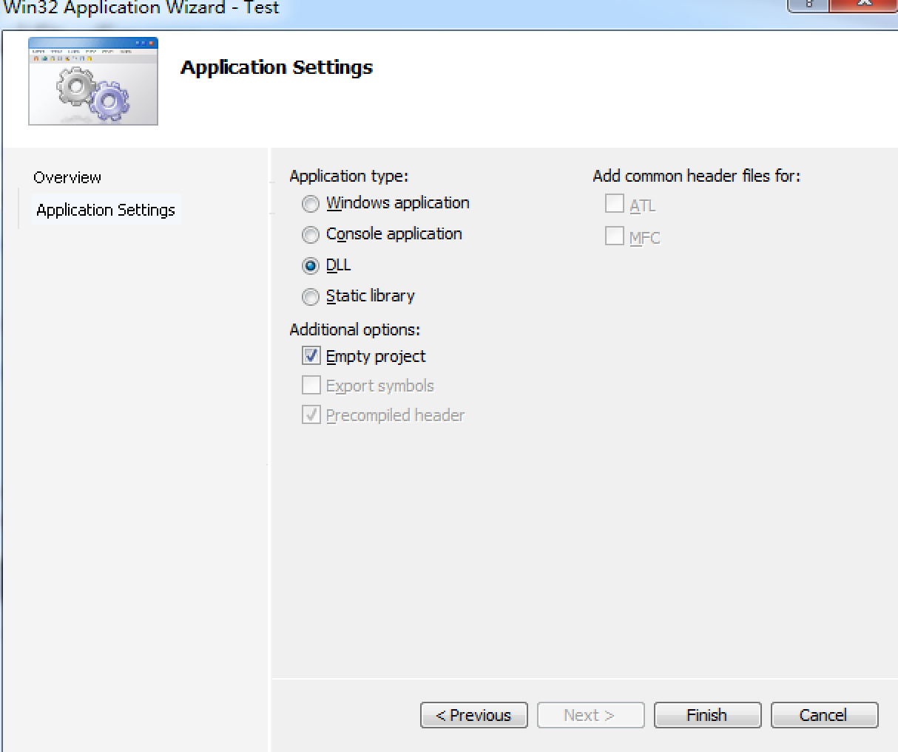

#C++ Code DLL file and call  

-------------------------------  

###0x00 目录  
1. 什么是DLL（动态链接库）  
2. 使用DLL的好处  
3. 创建和编写DLL文件  
4. 调用DLL  
	4.1 静态调用  
	4.2 动态调用  
5. 附录  
	5.1 extern “C”

###0x01 什么是DLL（动态链接库） 
DLL(Dynamic Link Library)文件为动态链接库文件，又称“应用程序拓展”，是软件文件类型。在Windows中，许多应用程序并不是一个完整的可执行文件，它们被分割成一些相对独立的动态链接库，即DLL文件，放置于系统中。当我们执行某一个程序时，相应的DLL文件就会被调用。一个应用程序可使用多个DLL文件，一个DLL文件也可能被不同的应用程序使用，这样的DLL文件被称为共享DLL文件。
 

###0x02 使用DLL的好处  
DLL是一个包含可由多个程序同时使用的代码和数据的库。例如：在Windows操作系统中，Comdlg32 DLL执行与对话框有关的常见函数。因此，每个程序都可以使用该DLL中包含的功能来实现“打开”对话框。这有助于促进代码重用和内存的有效使用。

使用DLL主要有以下优点：

1. 使用较少的资源；当多个程序使用同一函数库时，DLL可以减少在磁盘和物理内存中加载的代码的重复量。这不仅可以大大影响在前台运行的程序，而且可以大大影响其它在Windows操作系统上运行的程序；
2. 推广模块式体系结构；
3. 简化部署与安装。

###0x03 创建和编写DLL文件  
创建工程：  

工程创建完毕后，在工程中加入 `DllDemoHeader.h` 和 `DllDemoMain.cpp` 两个文件：  
`DllDemoHeader.h`:  
	
	#ifndef dllDemoHeader
	#define dllDemoHeader

	#ifdef DLLDEMO
	#define EXPOETS_DEMO _declspec(dllexport)
	#else
	#define EXPORTS_DEMO _declspec(dllimport)
	#endif

	extern "C" EXPORTS_DEMO int add(int a, int b);

	#endif
	
跟exe有个main或者WinMain入口函数一样，DLL也有一个入口函数，就是DllMain(仅导出资源的DLL可以没有DllMain函数)。

系统是在静态链接时，或动态链接时调用LoadLibrary和FreeLibrary都会调用DllMain函数。DllMain的第二个参数fdwReason指明了系统调用Dll的原因：  

1. `DLL_PROCESS_ATTACH`：当DLL被进程 <<第一次>> 调用时，导致DllMain函数被调用，如果同一个进程后来再次调用此DLL时，操作系统只会增加DLL的使用次数，不会再用DLL\_PROCESS\_ATTACH调用DLL的DllMain函数。  
2. `DLL_PROCESS_DETACH`：当DLL被从进程的地址空间解除映射时，系统调用了它的DllMain。(如果进程的终结是因为调用了TerminateProcess，系统就不会用DLL\_PROCESS\_DETACH来调用DLL的DllMain函数。这就意味着DLL在进程结束前没有机会执行任何清理工作。)
3. `DLL_THREAD_ATTACH`：当进程创建一线程时，系统查看当前映射到进程地址空间中的所有DLL文件映像，并用值DLL\_THREAD\_ATTACH调用DLL的DllMain函数。新创建的线程负责执行这次的DLL的DllMain函数，只有当所有的DLL都处理完这一通知后，系统才允许线程开始执行它的线程函数。
4. `DLL_THREAD_DETACH`：如果线程调用了ExitThread来结束线程（线程函数返回时，系统也会自动调用ExitThread），系统查看当前映射到进程空间中的所有DLL文件映像，并用DLL\_THREAD\_DETACH来调用DllMain函数，通知所有的DLL去执行线程级的清理工作。(注意：如果线程的结束是因为系统中的一个线程调用了TerminateThread，系统就不会用值DLL\_THREAD\_DETACH来调用所有DLL的DllMain函数。)

	

`DllDemoMain.cpp`:  

	#include "DllDemoHeader.h"

	int add(int a, int b) {
		return (a + b);
	}

###0x04 调用DLL  
当我们的程序需要使用DLL时，就需要去加载DLL，在程序中加载DLL有两种方法，分别为加载时动态链接（静态调用）和运行时动态链接（动态调用）。

1. 在加载时动态链接中，应用程序像调用本地函数一样对导出的DLL函数进行显示调用。要使用加载时动态链接，需要在编译和链接应用程序时提供头文件和导入库文件(.lib)。当这样做的时候，链接器将向系统提供加载DLL所需的信息，并在加载时解析导出的DLL函数的位置；
2. 在运行时动态链接中，应用程序调用LoadLibrary函数或LoadLibraryEx函数以在运行时加载DLL。成功加载DLL后，可以使用GetProcAddress函数获得要调用的导出的DLL函数的地址。在使用运行时动态链接时，不需要使用导入库文件。

__4.1 静态调用__  
静态调用的步骤：  

1. 把你的youApp.DLL拷到你目标工程的Debug目录下;  
2. 把你的youApp.lib拷到你目标工程目录下;  
3. 把你的youApp.h(包含输出函数的定义)拷到你目标工程目录下;  
4. 选择你的目标工程Head Files加入：youApp.h文件;  
5. 最后在你目标工程(*.cpp,需要调用DLL中的函数)中包含你的: `#include “youApp.h”`  

`DllDemoHeader.h`:  

	#ifndef DllDemoHeader
	#define DllDemoHeader

	#ifdef DLLDEMO
	#define EXPOETS_DEMO _declspec(dllexport)
	#else
	#define EXPORTS_DEMO _declspec(dllimport)
	#endif

	extern "C" EXPORTS_DEMO int add(int a, int b);

	#endif
	
`Main.cpp`:  

	#include "DllDemoHeader.h"
	#include <iostream>
	using namespace std;

	//load Dll_demo.lib
	#pragma comment(lib, "Dll_demo.lib")

	int main(int argc, char* argv[]) {

		cout << add(2, 3) << endl;

		system("pause");
		return 0;
	}
	

__4.2 动态调用__   
而动态调用中，只需要将 youApp.DLL 拷到你目标工程的Debug目录下。  

`Main.cpp`:  

	#include <windows.h>
	#include <iostream>
	using namespace std;

	//define 函数指针类型
	typedef int (*AddFunc)(int a, int b);

	int main(int argc, char* argv[]) {
		int a=10, b=5;
   
		HINSTANCE hDll = LoadLibrary(TEXT("Dll_demo.dll"));
		/*
		格式为hdll=LoadLibrary（“DLL地址”）；
		这里字符串类型是LPSTR，当是unicode字符集的时候会不行，
		因此要在配置-属性-常规里面把默认字符集“unicode”改成支持多字符扩展即可。
		或者：
		在这里使用 TEXT 转换一下
		*/

		AddFunc add = (AddFunc)GetProcAddress(hDll, "add");
		//GetProcAddress函数检索指定的动态链接库(DLL)中的输出库函数地址。

		if(add != NULL) {
			cout << add(a, b) << endl;
		}

		//release dll
		FreeLibrary(hDll);

		system("pause");
		return 0;
	}
	

###0x05 附录
__5.1 extern “C”__  
为什么要使用extern “C”呢？C++之父在设计C++时，考虑到当时已经存在了大量的C代码，为了支持原来的C代码和已经写好的C库，需要在C++中尽可能的支持C，而extern “C”就是其中的一个策略。  

”C”的含义。我们都知道C++通过函数参数的不同类型支持重载机制，编译器根据参数为每个重载函数产生不同的内部标识符；但是，如果遇到了C++程序要调用已经被编译后的C函数，那该怎么办呢？比如上面的int Add ( int a , int b )函数。该函数被C编译器后在库中的名字为_Add，而C++编译器则会生成像\_Add\_int\_int之类的名字用来支持函数重载和类型安全。由于编译后的名字不同，C++程序不能直接调用C函数，所以C++提供了一个C连接交换指定符号extern “C”来解决这个问题；所以，在上面的DLL中，Add函数的声明格式为：extern “C” EXPORTS\_DEMO int Add (int a , int b)。这样就告诉了C++编译器，函数Add是个C连接的函数，应该到库中找名字\_Add，而不是找\_Add\_int\_int。

 

--------------------------------  
References:  
果冻想: <http://www.jellythink.com/archives/111>  
CSDN.清闲居: <http://blog.csdn.net/zzxian/article/details/6762555>  
CSDN.friendan的专栏:  <http://blog.csdn.net/friendan/article/details/7659190>  
 
Author: xx  
Time: 2017.2.23