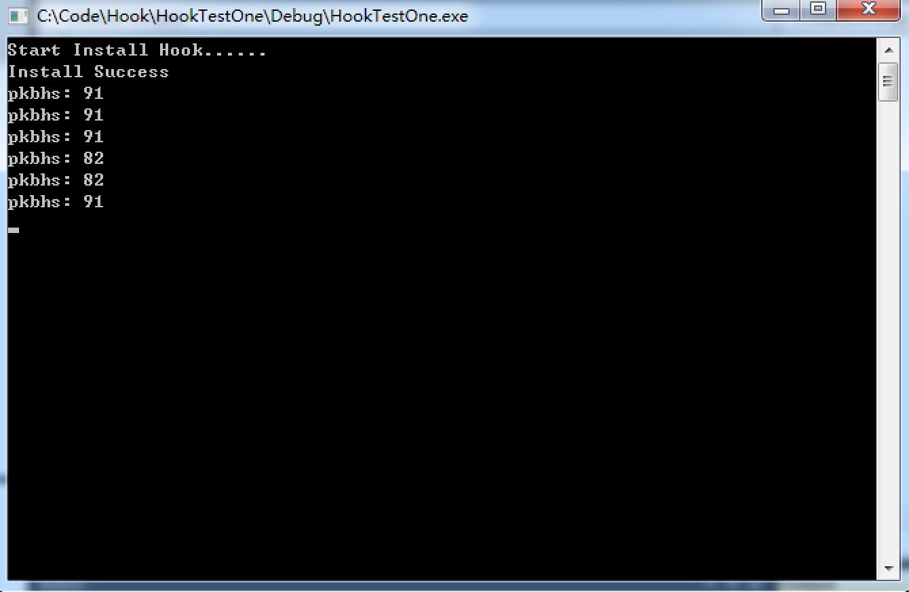

# Hook  

---------------------------------  
### 0x00 前言  
本文介绍了在 windows 环境下，利用 hook（钩子）技术对消息进行拦截处理。

### 0x01 简介  
__什么是Hook__  
钩子(Hook)是Windows消息处理机制的一个平台，可以在应用程序上面设置自己的消息回调函数以监视指定窗口的某种消息，而且所监视的窗口可以是其他进程所创建的。当消息到达后，在目标窗口处理函数之前处理它。钩子机制允许应用程序截获(且或)处理window消息或特定事件。钩子实际上是一个处理消息的程序段，通过系统调用，把它挂入系统。每当特定的消息发出，在没有到达目的窗口前，钩子程序就先捕获该消息，即钩子函数先得到控制权。这时钩子函数即可以加工处理（改变）该消息，也可以不作处理而继续传递该消息，还可以强制结束消息的传递。  

__钩子的运行机制__  
每一个Hook都有一个与之相关联的指针列表，称之为钩子链表，由系统来维护。  

这个列表的每一个节点中都有一个指针指向指定的，自定义的被系统回调的消息处理函数，也就是该种类型钩子的各个处理函数。  

当与指定的类型钩子有关联的消息发生时，系统就把这个消息传递到钩子消息处理函数。  

最后安装的钩子放在链表的开始，而最先安装的钩子放在最后，也就是后加入的先获得控制权。  

Windows 并不要求钩子消息处理函数的卸载顺序一定得和安装顺序相反。每当有一个钩子被卸载，Windows 便释放其占用的内存，并更新整个钩子链表。如果程序安装了钩子，但是在尚未卸载钩子之前就结束了，那么系统会自动为它做卸载钩子的操作。  

钩子消息处理函数是一个自定义的回调函数(CALLBACK Function)，不能定义成某个类的成员函数，只能定义为普通的C函数。用以监视系统或某一特定类型的事件，这些事件可以是与某一特定线程关联的，也可以是系统中所有线程的事件。  

__使用到的一些API__  

1. `HHOOK WINAPI SetWindowsHookEx(  _In_ int idHook,
  _In_ HOOKPROC  lpfn,
  _In_ HINSTANCE hMod,
  _In_ DWORD     dwThreadId)` 用于设置钩子。
2. `UnloadWindowsHookEx` 用于卸载钩子。
3. `LRESULT WINAPI CallNextHookEx(
  _In_opt_ HHOOK  hhk,
  _In_     int    nCode,
  _In_     WPARAM wParam,
  _In_     LPARAM lParam)` 将消息传递给hook链中的下一个单位。

### 0x02 程序  
如果要 hook 掉其他进程的消息或者是全局的消息，需要将回调函数写在 dll 文件中。

HookDllOne:  

	/**
	 * Description: This is dll file for hook program that catch all message from keyborad and print.
	 * Author: xx
	 * Time: 2017.2.27
	 * Version: 0.1
	 */

	#include <iostream>
	#include <Windows.h>
	using namespace std;

	#define MyHookDll extern "C" _declspec(dllexport)

	//define hook
	HHOOK hHook = NULL;

	/**
	 * CALLBACK function about keyboard.
	 * this function will be called while catch message(WM_KEYUP or WM_KEYDOWN) from keyboard.
	 */
	LRESULT CALLBACK KeyboardProc(int nCode, WPARAM wParam, LPARAM lParam) {
		//Contains information about a low-level keyboard input event.
		KBDLLHOOKSTRUCT *pkbhs = (KBDLLHOOKSTRUCT *)lParam;
		//print key value
		cout << "pkbhs: " << pkbhs->vkCode << endl;

		//
		if(nCode < 0) {
			return CallNextHookEx(hHook, nCode, wParam, lParam);
		}

		//return a nonzero value to prevent the system from passing the message to 
		//the rest of the hook chain or the target window procedure.
		return 1;
	}

	MyHookDll int setHook() {
		cout << "Start Install Hook......" << endl;
		hHook = SetWindowsHookEx(WH_KEYBOARD_LL, KeyboardProc, GetModuleHandle("HookDllOne"), 0);
		//dwThread set zero, the process will catch global message from keyborad.
		if(hHook == NULL) {
			cout << "SetWindowsHookEx Failed" << endl;
			system("pause");
			return -1;
		}
		cout << "Install Success" << endl;
		return 0;
	}

	MyHookDll int unloadHook() {
		if(hHook != NULL) {
			UnhookWindowsHookEx(hHook);
			cout << "UnloadHook Success" << endl;
		}
		return 0;
	}
	
	

执行文件 HookTestOne:  

	/**
	 * Description: This is test for hook, request HookDllOne.dll.
	 * Author: xx
	 * Time: 2017.2.27
	 * Version: 0.1
	 */

	#include <iostream>
	#include <Windows.h>
	using namespace std;

	typedef int(*SetHook)(void);
	typedef int(*UnloadHook)(void);

	int main(int argc, char* argv[]) {
		//load dll file
		HINSTANCE hInstance = LoadLibrary("HookDllOne.dll");
		SetHook setHook = (SetHook)GetProcAddress(hInstance, "setHook");
		UnloadHook unloadHook = (UnloadHook)GetProcAddress(hInstance, "unloadHook");

		//set hook
		setHook();

		//Windows Message Loop
		//receive and deliver message
		//win32 console application must include these codes.
		MSG msg;
		DWORD ret;
		while(ret = GetMessage(&msg, NULL, 0, 0)) {
			if(ret == -1) {
				break;		//error
			}
			TranslateMessage(&msg);
			DispatchMessage(&msg);
		}

		return 0;
	}
	
运行截图：  
(在任何窗口输入无反应，在程序窗口输出键值)  

	

 

-----------------------------------  
References: 
cnblogs.茄子写字板:  <http://www.cnblogs.com/handt/archive/2012/08/12/2633748.html>  
CSDN.Mr.Out的专栏:  <http://blog.csdn.net/cmdhack/article/details/6132383>  
Lellansin's:  <http://www.lellansin.com/windows-api-教程（七）-hook-钩子监听（编写中）.html>  
红超的吾记之谈的博客:  <http://blog.sina.com.cn/s/blog_4c451e0e01009qhn.html>  
 
Author: xx  
Time: 2017.2.27