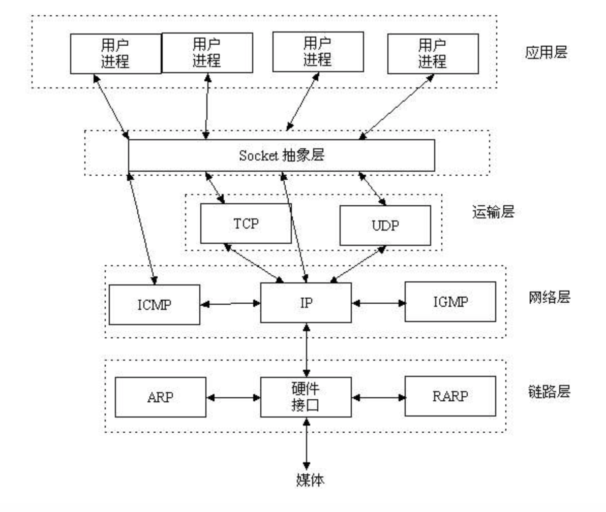
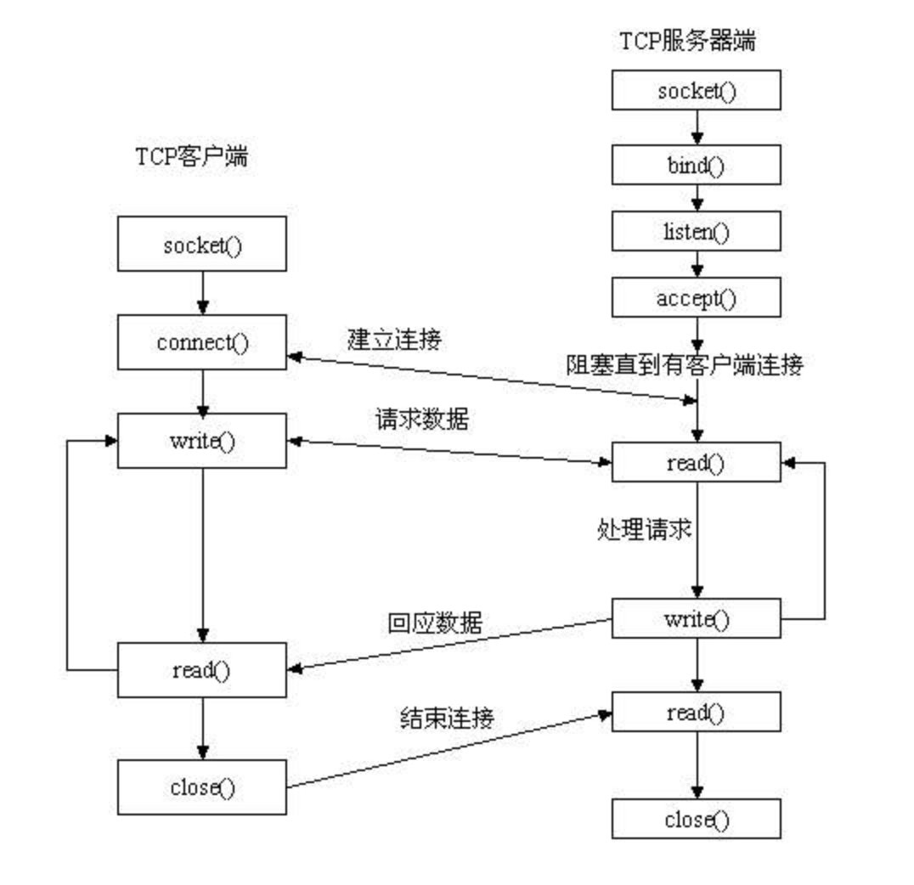

# Linux socket  

-------------------------  

### 0x00 前言  
本文介绍了在 Linux 下的 Socket 编程。

### 0x01 Socket简介 
网络上的两个程序通过一个双向的通信连接实现数据的交换，这个连接的一端称为一个socket。  

Socket是应用层与TCP/IP协议族通信的中间软件抽象层，它是一组接口。在设计模式中，Socket其实就是一个门面模式，它把复杂的TCP/IP协议族隐藏在Socket接口后面，对用户来说，一组简单的接口就是全部，让Socket去组织数据，以符合指定的协议。  

Socket所在层：  

Socket的处理流程：  

__socket()__  

	#include <sys/socket.h>
	int socket(int domain, int type, int protocol)
使用 socket 函数创建一个套接字。  

__shutdown()__  

	#include <sys/socket.h>
	int shutdown(int sockfd, int how);
用于禁止一个套接字的I/O。

__地址格式__   
因特网地址定义在`<netinet/in.h>`头文件中。在IPv4(AF\_INET)中，套接字地址用结构`sockaddr_in`表示：  

	struct in_addr {
		in_addr_t s_ addr;	/* IPv4 address */
	}
	
	struct sockaddr_in {
		sa_family_t sin_family;		/* address family */
		in_port_t sin_port;			/* port number */
		struct in_addr sin_addr;	/* IPv4 address */
	}
IPv6(AF\_INET6)套接字地址用结构 sockaddr\_in6 表示： 

	struct in6_addr {
		uint_8 s6_addr[16]		/* Ipv6 address */
	}	
	
	struct sockaddr_in6 {
		sa_family_t sin6_family;		/* address family */
		in_port_t sin6_port;			/* port number */
		uint32_t sin6_flowinfo;			/* traffic class and flow info */
		struct in6_addr sin6_addr;		/* IPv6 address */
		uint32_t sin6_scope_id;			/* set of interfaces for scope */
	}
	
__bind()__  

	#include <sys/socket.h>
	int bind(int sockfd, const struct sockaddr *addr, socklen_t len);
关联地址和套接字。 

__connect()__  

	#include <sys/socket.h>
	int connect(int sockfd, const struct sockaddr *addr, socket_t len);
用在请求服务的进程套接字（客户端）和提供服务的进程套接字（服务器）之间建立一个连接。  

__listen()__  

	#include <sys/socket.h>
	int listen(int sockfd, int backlog);
服务器调用 listen 来表示它愿意接受连接。

__accept()__  

	#include <sys/socket.h>
	int accept(int sockfd, struct sockaddr * restrict addr, socklen_t *restrict len);
服务端使用 accept 函数获取连接请求并建立连接。

__send()__  

	#include <sys/socket.h>
	ssize_t send(int sockfd, const void *buf, size_t nbytes, int flags);
和 write 很像，发送消息。  

__recv()__  

	#include <sys/socket.h>
	ssize_t recv(int sockfd, void *buf, size_t nbytes, int flags);
和 read 很像，接受消息。

### 0x02 程序 
Server端：  

	/**
	 * Description: This is test for socket in linux.This is server
	 * Author: xx
	 * Time: 2017.2.27
	 * Version: 0.1
	 */

	#include <stdio.h>
	#include <stdlib.h>
	#include <sys/socket.h>
	#include <netinet/in.h>
	#include <sys/types.h>

	int main(int argc, char* argv[]) {
		int socketServ = 0;
		struct sockaddr_in addr;

		//create socket
		socketServ = socket(PF_INET, SOCK_STREAM, 0);
		if(socketServ == -1) {
			printf("socket failed");
			return -1;
		}

		//initialize "addr"
		memset(&addr, 0, sizeof(addr));
		addr.sin_family = AF_INET;
		addr.sin_port = htons(7777);	//port 7777
		addr.sin_addr.s_addr = htonl(INADDR_ANY);		//ip 0.0.0.0

		//bind 
		if(bind(socketServ, (struct sockaddr*)&addr, sizeof(addr)) < 0) {
			printf("bind failed");
			return -1;
		}

		//listen
		if(listen(socketServ, 5) < 0) {
			printf("listen failed");
			return -1;
		}

		//
		int client = -1;
		struct sockaddr_in client_name;
		socklen_t client_name_len = sizeof(client_name);

		//accept request form client
		client = accept(socketServ, (struct sockaddr*)&client, &client_name_len);
		printf("Accept Success\n");

		//
		char buf[1024];
		memset(&buf, 0, sizeof(buf));
		sprintf(buf, "Welcome to Server.\n");
		send(client, buf, sizeof(buf), 0);

		close(client);
		close(socketServ);

		return 0;
	}

Client端：  

	/**
	 * Description: This is test for socket in linux.This is client.
	 * Author: xx
	 * Time: 2017.2.27
	 * Version: 0.1
	 */

	#include <stdio.h>
	#include <stdlib.h>
	#include <sys/socket.h>
	#include <netinet/in.h>
	#include <sys/types.h>

	int main(int argc, char* argv[]) {
		int socketClient = 0;
		struct sockaddr_in addr;

		//create socket
		socketClient = socket(PF_INET, SOCK_STREAM, 0);
	if(socketClient == -1) {
			printf("socket failed");
			return -1;
		}

		//initialize addr
		memset(&addr, 0, sizeof(addr));
		addr.sin_family = AF_INET;
		addr.sin_port = htons(7777);
		addr.sin_addr.s_addr = inet_addr("127.0.0.1");

		//start to request server.
		int err = 0;
		err = connect(socketClient, (struct sockaddr *)&addr, sizeof(addr));
		if(err == -1) {
			printf("connect failed");
			return -1;
		}

		//after request success, receive message from server.
		char buf[1024];
		recv(socketClient, buf, sizeof(buf), 0);
		printf("%s", buf);

		return 0;
	}

  

------------------------  
References:  
《Unix环境高级编程》  
cnblogs.旭东的博客:  <http://www.cnblogs.com/xudong-bupt/archive/2013/12/29/3483059.html>  
 
Author: xx  
Time: 2017.2.28