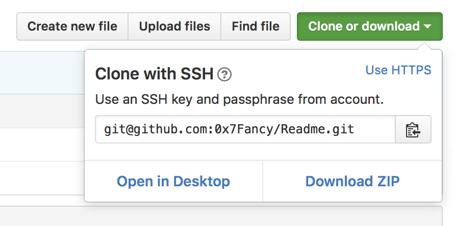

#Git & Github  

---------------------------

###0x00 Git简介  
由Linus花了两周用C写出的一个分布式版本控制系统。  

#####目录  
1. aa
2. bb

 

__集中式与分布式__  
CVS和SVN都是集中化的版本控制系统，版本库是集中存放在中央服务器的，而干活的时候，用的都是自己的电脑，所以要先从中央服务器取得最新的版本，然后开始干活，干完活了，再把自己的活推送给中央服务器。  
Git是一个分布式的版本控制系统，分布式版本控制系统根本没有“中央服务器”，每个人的电脑上都是一个完整的版本库，这样，你工作的时候，就不需要联网了，因为版本库就在你自己的电脑上。既然每个人电脑上都有一个完整的版本库，那多个人如何协作呢？比方说你在自己电脑上改了文件A，你的同事也在他的电脑上改了文件A，这时，你们俩之间只需把各自的修改推送给对方，就可以互相看到对方的修改了。

###0x01 Git的基础使用  
1. __创建版本库__  
>什么是版本库呢？  
	
	版本库又名仓库，英文名repository，你可以简单理解成一个目录，这个目录里面的所有文件（目前所有的版本控制系统只能对文本文件进行处理）都可以被Git管理起来，每个文件的修改、删除，Git都能跟踪，以便任何时刻都可以追踪历史，或者在将来某个时刻可以“还原”。  
>创建版本库

	创建一个新的文件夹，执行：  

		$ git init
		Initialized empty Git repository in /Users/xx/Documents/git/.git/
这样就创建好了一个空的仓库，在目录下有个.git隐藏文件目录，这个目录是Git来跟踪管理版本库的。
当安装完 Git 应该做的第一件事就是设置你的用户名称与邮件地址。 这样做很重要，因为每一个 Git 的提交都会使用这些信息，并且它会写入到你的每一次提交中，不可更改：

		$ git config --global user.name "xx"
		$ git config --global user.email xx@example.com

2. __提交__  
先创建好的仓库下把文件添加进去，我们现在编写一个文件Readme.txt:  

		Git is a version control system.
		Git is free software.  
第一步，使用 `git add` 把文件添加到仓库：  
		
		$ git add Readme.txt
没有显示任何错误就执行成功了，  
第二步，使用 `git commit` 把文件提交到仓库：  

		 $ git commit -m "wrote a readme.txt"
		[master (root-commit) 6881370] wrote a readme.txt 1 file changed, 2 insertions(+) create mode 100644 Readme.txt
>刚才执行的 `git commit` 命令 `-m` 后面是本次提交的说明； `git commit` 执行后，会显示1个文件被改动，插入了两行内容。  
这里简单说下 `add` `commit` ，`add` 是先放到Git的暂存区里，`commit` 是提交到Git仓库中，详细会 `4. 工作区与暂存区` 中提及。

3. __git status和git diff__  
>git status  

	`git status` 命令可以让我们时刻掌握仓库当前的状态。  
我们修改Readme.txt的内容：  

		Git is a distributed version control system.
		Git is free software.
执行 `git status` 后：  

		$ git status
		On branch master
		Changes not staged for commit:
		(use "git add <file>..." to update what will be committed)
		(use "git checkout -- <file>..." to discard changes in working directory)
		modified:   Readme.txt
		no changes added to commit (use "git add" and/or "git commit -a")
上面的命令告诉我们，readme.txt被修改过了，但还没有准备提交的修改。若要看具体是哪些内容进行了修改，则要使用 `git diff` 命令。
>git diff  
	
	使用 `git diff` 查看内容修改：  

		$ git diff Readme.txt 
		diff --git a/Readme.txt b/Readme.txt
		index 46d49bf..9247db6 100644
		--- a/Readme.txt
		+++ b/Readme.txt
		@@ -1,2 +1,2 @@
		-Git is a version control system.
		+Git is a distributed version control system.
		 Git is free software.
上面的命令输出看到，我们在第一行添加了一个“distributed”单词。  
>提交修改  

	提交修改和提交新文件是一样的。  
第一步，执行 `git add`：  
	
		git add Readme.txt
这里使用 `git status` 看一看：  

		$ git status
		On branch master
		Changes to be committed:
		(use "git reset HEAD <file>..." to unstage)
		modified:   Readme.txt
显示了被提交的修改包括readme.txt，接下来就可以提交了 `git commit`：  

		$ git commit -m "add distributed"
		[master c521b09] add distributed
		1 file changed, 1 insertion(+), 1 deletion(-)
再使用 `git status` 看看：  

		$ git status
		On branch master
		nothing to commit, working directory clean
Git告诉我们当前没有需要提交的修改，而且，工作目录是干净的。

4. __版本回退__  
再提交一个修改，便于后面的操作，修改 Readme.txt文件：  

		Git is a distributed version control system.
		Git is free software distributed under the GPL.
提交：  

		$ git add Readme.txt 
		$ git commit -m "append GPL"
		[master e4de391] append GPL
		1 file changed, 1 insertion(+), 1 deletion(-)
在使用的过程中，Git为你的文件“保存一个快照”，这个快照在Git中被称为commit。一旦你把文件改乱了，或者误删了文件，还可以从提交的commit恢复。  
>使用 `git log` 查看历史记录：  
	
		$ git log
		commit e4de391a2adfc640d5f30dbd7d52b6b262634f24
		Author: xx <example@gmail.com>
		Date:   Mon Oct 24 13:08:21 2016 +0800

    	append GPL

		commit c521b09f379d4ca6144d3eb266af4cbb325a20fb
		Author: xx <example@gmail.com>
		Date:   Mon Oct 24 12:52:54 2016 +0800

    	add distributed

		commit 68813709bd4db8ac4581f78a3d9d3833c9960355
		Author: xx <example@gmail.com>
		Date:   Mon Oct 24 12:26:35 2016 +0800

    	wrote a readme.txt
`git log` 显示了从近到远的 `commit` 记录，可以使用 `git log --pretty=oneline` 显示一行简介。  
在上面的内容中 `68813709bd4db8ac4581f78a3d9d3833c9960355` 这样的东西是 `commit id` ，是版本号。  
>版本回退  

	在Git中，用 `HEAD` 表示当前版本，上一个版本就是 `HEAD^` ，上上一个版本就是` HEAD^^` ， 上100个版本就是 `HEAD~100` ，或者直接使用版本号 `commit id`
现在从 `append GPL` 回退到 `add distributed` ，使用 `git reset` 命令：  
		
		$ git reset --hard head^
		HEAD is now at c521b09 add distributed
打开Readme.txt看看：  

		$ cat Readme.txt 
		Git is a distributed version control system.
		Git is free software.
发现内容已经修改了。（上面命令中的 `--hard` 参数，详细请看 `10. git reset` ）
>撤销回退
	
	运行到这里时，有个问题，运行 `git log` 看看：  
		
		$ git log
		commit c521b09f379d4ca6144d3eb266af4cbb325a20fb
		Author: xx <example@gmail.com>
		Date:   Mon Oct 24 12:52:54 2016 +0800

    	add distributed

		commit 68813709bd4db8ac4581f78a3d9d3833c9960355
		Author: xx <example@gmail.com>
		Date:   Mon Oct 24 12:26:35 2016 +0800

    	wrote a readme.txt
发现已经没有了 `append GPL` 这个版本了，如果撤销回退，就必须找到 `append GPL` 的 `commit id` , Git提供了命令 `git reflog` 来记录你的每一条命令：  

		$ git reflog
		c521b09 HEAD@{0}: reset: moving to head^
		e4de391 HEAD@{1}: commit: append GPL
		c521b09 HEAD@{2}: commit: add distributed
		6881370 HEAD@{3}: commit (initial): wrote a readme.txt
找到了 `append GPL` 的 `commit id` ，我们就可以恢复了：  

		$ git reset --hard e4de391
		HEAD is now at e4de391 append GPL
		$ cat Readme.txt 
		Git is a distributed version control system.
		Git is free software distributed under the GPL.
已经恢复到 `append GPL` 这个版本了。

5. __工作区与暂存区__  
>工作区

	就是你在电脑里能看到的目录，比如我的 `git` 文件夹就是一个工作区。  
>版本库  

	工作区有一个隐藏目录 `.git`，是Git的版本库。
Git的版本库里存了很多东西，其中最重要的就是称为 `stage` （或者叫 `index` ）的暂存区，还有Git为我们自动创建的第一个分支 `master`， 以及指向 `master` 的一个指针叫 `HEAD`。

	  
	(Picture From: 廖雪峰的官方网站)
  
	前面讲了我们把文件往Git版本库里添加的时候，是分两步执行的：

	第一步是用`git add`把文件添加进去，实际上就是把文件修改添加到暂存区；

	第二步是用`git commit`提交更改，实际上就是把暂存区的所有内容提交到当前分支。

	因为我们创建Git版本库时，Git自动为我们创建了唯一一个`master`分支，所以，现在，`git commit`就是往`master`分支上提交更改。  

6. 管理修改  
Git管理的是修改，而不是文件。  
>举个例子  

	首先`Readme.txt`的内容是：  
		
		Git is a distributed version control system.
		Git is free software distributed under the GPL.
修改`Readme.txt`的内容：  

		Git is a distributed version control system.
		Git is free software distributed under the GPL.
		This is a test
通过`git add`加入到暂存区： 
 
		git add Readme.txt
接着继续修改`Readme.txt`文件：  

		Git is a distributed version control system.
		Git is free software distributed under the GPL.
		This is a test
		Second modify
现在使用`git commit`提交：  

		git commit -m "modify"
现在我们看看`git status`：  

		$ git status
		On branch master
		Changes not staged for commit:
		  (use "git add <file>..." to update what will be committed)
		  (use "git checkout -- <file>..." to discard changes in working directory)
			modified:   Readme.txt
		no changes added to commit (use "git add" and/or "git commit -a")
有内容没有被提交？用`git diff`看看是哪里的修改：  
		
		$ git diff Readme.txt 
		diff --git a/Readme.txt b/Readme.txt
		index b66cdb6..7cc9694 100644
		--- a/Readme.txt
		+++ b/Readme.txt
		@@ -1,3 +1,4 @@
		 Git is a distributed version control system.
		 Git is free software distributed under the GPL.
		 This is a test
		+second modify
是第二次的修改没有被提交。  

	第一次的提交过程是：  
第一次修改 -> `git add` -> 第二次修改 -> `git commit`  

	所有说Git管理的是修改，当你用`git add`命令后，在工作区的第一次修改被放入暂存区，准备提交，但是，在工作区的第二次修改并没有放入暂存区，所以，`git commit`只负责把暂存区的修改提交了，也就是第一次的修改被提交了，第二次的修改不会被提交。

7. __撤销修改__  
对文件完成修改后，在提交前发现有错误，需要回到撤销对文件的修改时，用下面的方法：  

	`Readme.txt`中的内容：  
	
		$ cat Readme.txt 
		Git is a distributed version control system.
		Git is free software distributed under the GPL.
		Error
现在要删除刚才添加的`Error`，使用命令`git checkout -- <file>` ： 

		$ git checkout -- Readme.txt 
文件已经恢复到修改之前：  
		
		$ cat Readme.txt 
		Git is a distributed version control system.
		Git is free software distributed under the GPL.
命令`git checkout -- Readme.txt`意思就是，把`Readme.txt`文件在工作区的修改全部撤销，这里有两种情况：

	一种是`Readme.txt`自修改后还没有被放到暂存区，现在，撤销修改就回到和版本库一模一样的状态；

	一种是`Readme.txt`已经添加到暂存区后，又作了修改，现在，撤销修改就回到添加到暂存区后的状态。

	总之，就是让这个文件回到最近一次`git commit`或`git add`时的状态。

8. __删除文件__  
在Git中，删除也是一个修改操作，先添加一个新文件test.txt到Git并且提交：  
		
		 git add test.txt 
		$ git commit -m "add test.txt"
		[master 4b55b50] add test.txt
		 1 file changed, 0 insertions(+), 0 deletions(-)
		 create mode 100644 test.txt
一般情况下，在文件管理器中使用`rm`删除文件：  

		rm test.txt
这个时候，Git知道你删除了文件，工作区和版本库不一致了，使用`git status`看看：  

		$ git status
		On branch master
		Changes not staged for commit:
		  (use "git add/rm <file>..." to update what will be committed)
		  (use "git checkout -- <file>..." to discard changes in working directory)
			deleted:    test.txt
		no changes added to commit (use "git add" and/or "git commit -a")
>从版本库中删除

	此时版本库中还有这个文件，如果要从版本库中删除，就使用命令`git rm`删除，并且`git commit`：  

		$ git rm test.txt
		rm 'test.txt'
		$ git commit -m "remove test.txt"
		[master 4f06de7] remove test.txt
		 1 file changed, 0 insertions(+), 0 deletions(-)
		 delete mode 100644 test.txt
>误删，从版本库中恢复 	
	
	因为版本库中有文件，所有可以直接恢复：  
		
		git checkout -- test.txt
 
9. __git reset__

###0x02 远程仓库  
可以自行搭建Git服务器，或者使用Github。下面的介绍Github远程仓库的使用。  

1. __Github的配置__  
	1. 到 Github 注册账号  
	2. 本地配置用户名和邮箱  
	3. 本地生成 ssh key  
			
			ssh-keygen -t rsa -C "your email"
			
		它会有三次等待你输入，直接回车即可。  
		完成后，找到本目录下的隐藏文件 `.ssh` 复制文件下的公钥 `id_rsa.pub` 的内容
	4. 打开 Github，到 Settings 页面，点击左边的 `SSH and GPG keys`, 将刚才复制的公钥粘贴到右边的Key中。
	5. 在本地使用 `ssh -T git@github.com` 测试链接。			
2. __创建远程仓库并与本地关联__  
	1. 先在 Github 上创建一个远程仓库  
	2. 复制远程仓库地址  
		先到Github上复制远程仓库的SSH地址：  
		  
		
	3. 在本地新建的仓库中执行 `git remote add origin 你复制的地址`：  

			git remote add origin git@github.com:0x7Fancy/Readme.git
			
		使得本地仓库和远程仓库建立连接。
	
	4. 使用 `git pull origin mater` ，使本地仓库同步远程仓库：  

			$ git pull origin master
			remote: Counting objects: 39, done.
			remote: Compressing objects: 100% (19/19), done.
			remote: Total 39 (delta 9), reused 38 (delta 8), pack-reused 0
			Unpacking objects: 100% (39/39), done.
			From github.com:0x7Fancy/Readme
			 * branch            master     -> FETCH_HEAD
			 * [new branch]      master     -> origin/master		
	
	5. 本地对文件进行修改后，提交到本地仓库，再执行 `git push -u origin master` 将本地仓库上传到 Github 的仓库：  

			$ git push -u origin master
			Counting objects: 3, done.
			Delta compression using up to 4 threads.
			Compressing objects: 100% (2/2), done.
			Writing objects: 100% (3/3), 255 bytes | 0 bytes/s, done.
			Total 3 (delta 1), reused 0 (delta 0)
			remote: Resolving deltas: 100% (1/1), completed with 1 local objects.
			To git@github.com:0x7Fancy/Readme.git
			   de3f9f4..ce85f91  master -> master
			Branch master set up to track remote branch master from origin.

	>注意：使用 `git clone` 是直接把远程仓库 down 到本地。

3. __获取其他人的远程仓库并提交__   
	1. 在 Github 上 fork 别人的项目
	2. 本地仓库获取自己 Github 上 fork 的别人的项目
	3. 在本地仓库对文件进行修改并提交
	4. 从本地仓库 `git push` 到自己的 Github 上
	5. 在 Github 使用 `pull request` 向创建者申请合并

###0x03 分支管理  
Git 中创建、合并和删除分支非常快，所以Git鼓励你使用分支完成某个任务，合并后再删掉分支，这和直接在master分支上工作效果是一样的，但过程更安全。

1. __创建与合并分支__  
Git 都把每次提交串成一条时间线，这条时间线就是一个分支。截止到目前，只有一条时间线，在 Git 里，这个分支叫主分支，即`master`分支。`HEAD`严格来说不是指向提交，而是指向`master`，`master`才是指向提交的，所以，`HEAD`指向的就是当前分支。  

	一开始的时候，`master`分支是一条线，Git用`master`指向最新的提交，再用`HEAD`指向`master`，就能确定当前分支，以及当前分支的提交点：  
	  
	
	当我们创建新的分支，例如`dev`时，Git新建了一个指针叫`dev`，指向`master`相同的提交，再把`HEAD`指向`dev`，就表示当前分支在`dev`上： 
	
	
	
	Git创建一个分支很快，因为除了增加一个`dev`指针，改改`HEAD`的指向，工作区的文件都没有任何变化！
	
	从现在开始，对工作区的修改和提交就是针对`dev`分支了，比如新提交一次后，`dev`指针往前移动一步，而`master`指针不变：  
	
	  
	
	假如我们在`dev`上的工作完成了，就可以把`dev`合并到`master上`。Git怎么合并呢？最简单的方法，就是直接把`master`指向`dev`的当前提交，就完成了合并：

	  
	
	合并完分支后，甚至可以删除`dev`分支。删除`dev`分支就是把`dev`指针给删掉，删掉后，我们就剩下了一条`master`分支：  
	
	  
	
	>理解 Git 的分支后，进行操作
	
	首先，我们创建`dev`分支，然后切换到`dev`分支：  
	
		$ git checkout -b dev
		Switched to a new branch 'dev'
	`git checkout`命令加上`-b`参数表示创建并切换，相当于以下两条命令： 
		
		$ git branch dev
		$ git checkout dev
		Switched to branch 'dev'
然后，用`git branch`命令查看当前分支：  

		$ git branch
		* dev
		  master
`git branch`命令会列出所有分支，当前分支前面会标一个*号。

	然后，我们就可以在`dev`分支上正常提交，比如对`Readme.txt`做个修改，加上一行：  
	
		This is dev branch.
然后提交：  

		$ git add Readme.txt 
		$ git commit -m "dev branch"
		[dev b277075] dev branch
		 1 file changed, 1 insertion(+)
现在，`dev`分支的工作完成，我们就可以切换回`master`分支：  

		$ git checkout master
		Switched to branch 'master
切换回`master`分支后，再查看一个`Readme.txt`文件，刚才添加的内容不见了！因为那个提交是在`dev`分支上，而`master`分支此刻的提交点并没有变：  

	
	
	现在，我们把`dev`分支的工作成果合并到`master`分支上：  
	
		$ git merge dev
		Updating ce85f91..b277075
		Fast-forward
		 Readme.txt | 1 +
		 1 file changed, 1 insertion(+)
`git merge`命令用于合并指定分支到当前分支。合并后，再查看`Readme.txt`的内容，就可以看到，和`dev`分支的最新提交是完全一样的。

	注意到上面的`Fast-forward`信息，Git告诉我们，这次合并是“快进模式”，也就是直接把`master`指向`dev`的当前提交，所以合并速度非常快。

	合并完成后，就可以放心地删除dev分支了：  
	
		$ git branch -d dev
		Deleted branch dev (was b277075).
		$ git branch
		* master

2. __解决冲突__  
假如我的仓库中有两条分支：  

		$ git checkout -b feature1
		Switched to a new branch 'feature1'
		$ git branch
		* feature1
		  master
现在我在`feature1`分支下对`Readme.txt`进行修改： 

		Git is a version control system.
		Git is free software under.
		This a and b
提交： 		
		
		$ git add -A
		$ git commit -m "a+b"
		[feature1 dcfbfb4] a+b
		 1 file changed, 3 deletions(-) 

	然后又在`master`分支下对`Readme.txt`进行修改：    

		Git is a version control system.
		Git is free software under.
		This a & b
	提交：  
	
		$ git add -A
		$ git commit -m "a&b"
		[master b16cd12] a&b
		 1 file changed, 1 insertion(+), 4 deletions(-)

	分支就成这样了，现在`git merge`合并就会出现冲突了：  

	  
	
	我们在`master`分支下执行合并：  
	
		$ git merge feature1
		Auto-merging Readme.txt
		CONFLICT (content): Merge conflict in Readme.txt
		Automatic merge failed; fix conflicts and then commit the result.
	这里说 合并发生了冲突， 这里需要手动合并。  
	
	在 `master` 下 `vim` 编辑文件可以看到：  
	
		Git is a version control system.
		Git is free software under.
		<<<<<<< HEAD
		This a & b
		=======
		This a and b
		>>>>>>> feature1
	Git用`<<<<<<<`，`=======`，`>>>>>>>`标记出不同分支的内容，我们修改如下后保存：  
	
		Git is a version control system.
		Git is free software under.
		This a and b
	然后再提交：  
	
		$ git add Readme.txt 
		$ git commit -m "conflict fixed"
		[master 7cf31d3] conflict fixed
	用`git log`看下分支的合并情况：  
	
		$ git log --graph --pretty=oneline
		*   7cf31d3000949f6d16a23454f7a3268c7f994766 conflict fixed
		|\  
		| * dcfbfb40748fbe0fea6aa829226154e849e06c05 a+b
		* | b16cd12a9e46ab255f3d10bf7434b5f01409e587 a&b
		|/  

 
3. __多人协作__  
当你从远程仓库克隆时，实际上Git自动把本地的`master`分支和远程的`master`分支对应起来了，并且，远程仓库的默认名称是`origin`。

	要查看远程库的信息，用`git remote`：  
	
		$ git remote
		origin
		
	或者，用`git remote -v`显示更详细的信息：  
	
		$ git remote -v
		origin	git@github.com:0x7Fancy/Readme.git (fetch)
		origin	git@github.com:0x7Fancy/Readme.git (push)
上面显示了可以抓取和推送的`origin`的地址。如果没有推送权限，就看不到`push`的地址。

	>推送分支
	
	推送分支，就是把该分支上的所有本地提交推送到远程库。推送时，要指定本地分支，这样，Git就会把该分支推送到远程库对应的远程分支上：  
	
		$ git push origin master
		Counting objects: 29, done.
		Delta compression using up to 4 threads.
		Compressing objects: 100% (29/29), done.
		Writing objects: 100% (29/29), 2.41 KiB | 0 bytes/s, done.
		Total 29 (delta 17), reused 0 (delta 0)
		remote: Resolving deltas: 100% (17/17), completed with 1 local objects.
		To git@github.com:0x7Fancy/Readme.git
		   ce85f91..7cf31d3  master -> master

	>抓取分支
	
	多人协作时，大家都会往`master`和`dev`分支上推送各自的修改。  

	现在，模拟一个你的小伙伴，可以在另一台电脑（注意要把SSH Key添加到GitHub）或者同一台电脑的另一个目录下克隆，当你的小伙伴从远程库clone时，默认情况下，你的小伙伴只能看到本地的master分支。
	
	现在，你的小伙伴要在dev分支上开发，就必须创建远程origin的dev分支到本地，于是他用这个命令创建本地dev分支：  
	
		$ git checkout -b dev origin/dev
	现在，他就可以在dev上继续修改，然后，时不时地把dev分支push到远程。
	
	你的小伙伴已经向origin/dev分支推送了他的提交，而碰巧你也对同样的文件作了修改，并试图推送，但是会推送失败，因为你的小伙伴的最新提交和你试图推送的提交有冲突，解决办法也很简单，Git已经提示我们，先用git pull把最新的提交从origin/dev抓下来，然后，在本地合并，解决冲突，再推送。
	
	>`git push` 命令相当于两条命令：`git fetch` + `git merge`

  
###0x04 搭建Git服务器  

........- -时间有点急，没来得及写，其实很简单，因为 Git 是分布式的，所以把一台当作是服务器就行了，再给服务器配上 ssh 就可以了。

 

----------------------------------
参考资料：  
RUNOOB.COM：  <http://www.runoob.com/w3cnote/git-guide.html>  
博客园.Schaepher：  <http://www.cnblogs.com/schaepher/p/5561193.html>  
廖雪峰官方网站.Git教程：  <http://www.liaoxuefeng.com/wiki/0013739516305929606dd18361248578c67b8067c8c017b000>  
阮一峰的网络日志.Git的分支管理策略：  <http://www.ruanyifeng.com/blog/2012/07/git.html>  

 
Author: xx  
Time: 2016.10.24
 
