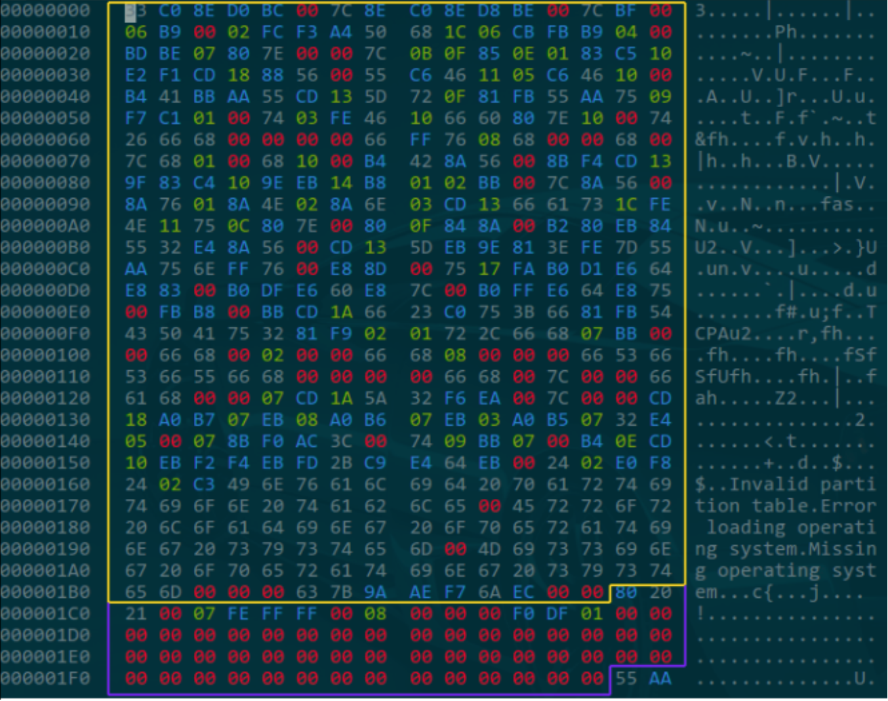
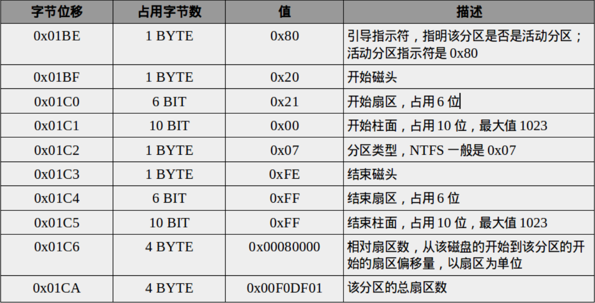

# Main Boot Record 
--------------------------------  

### 0x00 前言  
主引导记录（MBR，Main Boot Record）是位于磁盘最前边的一段引导（Loader）代码。它负责磁盘操作系统(DOS)对磁盘进行读写时分区合法性的判别、分区引导信息的定位，它由磁盘操作系统(DOS)在对硬盘进行初始化时产生的。  

### 0x01 MBR简介  
MBR主引导扇区位于磁盘的第一个扇区(0柱面，0磁头，1扇区)，即0号扇区，主要由引导代码、分区表、结束标志三部分构成，总共占512字节。  

  

通常，我们将包含MBR引导代码的扇区称为主引导扇区。因这一扇区中，引导代码占有绝大部分的空间，故而将习惯将该扇区称为MBR扇区（简称MBR）。由于这一扇区承担有不同于磁盘上其他普通存储空间的特殊管理职能，作为管理整个磁盘空间的一个特殊空间，它不属于磁盘上的任何分区，因而分区空间内的格式化命令不能清除主引导记录的任何信息。

主引导扇区由三个部分组成(共占用512个字节)：

1. 引导代码  
上图中黄色框内的部分即为引导程序，占扇区前446字节。计算机在上电完成BIOS自检后，会将该主引导扇区加载到内存中并执行前面446字节的引导程序，引导程序首先会在分区表中查找活动分区，若存在活动分区，则根据活动分区的偏移量找到该活动分区上的引导扇区的地址，并将该引导扇区加载到内存中，同时检查该引导扇区的有效性，然后根据该引导扇区的规则去引导操作系统。在一些非启动磁盘上，MBR引导代码可能都是0，这对磁盘使用没有任何影响。

2. 分区表  
上图中蓝色框内的部分即为分区表，占扇区中间64字节。分区表是磁盘管理最重要的部分，通过分区表信息来定位各个分区，访问用户数据。分区表包含4个分区项，每一个分区项通过位置偏移、分区大小来唯一确定一个主分区或者扩展分区。每个分区项占16字节，包括引导标识、起始和结束位置的CHS参数、分区类型、开始扇区、分区大小等。

3. 结束标志  
上图中最后的"55 AA"即为结束标志，或者称魔数，占扇区最后2字节。每次执行系统引导代码时都会检查MBR主引导扇区最后2字节是否是"55 AA"，若是，则继续执行后续的程序，否则，则认为这是一个无效的MBR引导扇区，停止引导系统。

### 0x02 分区信息结构  
占用512个字节的MBR中，偏移地址01BEH--01FDH的64个字节，每个分区项占用0x10个字节，这0x10个字节中存有活动状态标志、文件系统标识、起止柱面号、磁头号、扇区号、隐含扇区数目(4个字节)、分区总扇区数目(4个字节)等内容。由于MBR扇区只有0x40个字节用于分区表，所以只能记录4个分区的信息。这就是硬盘主分区数目(注意是主分区) 不能超过4个的原因。后来为了支持更多的分区，引入了扩展分区及逻辑分区的概念。但每个分区项仍用16个字节存储。  

主分区数目不能超过4个的限制，很多时候，4个主分区并不能满足需要。另外最关键的是MBR分区方案无法支持超过2TB容量的磁盘。因为这一方案用4个字节存储分区的总扇区数，最大能表示2^32次方个扇区，按每扇区512字节计算，每个分区最大不能超过2TB。磁盘容量超过2TB以后，分区的起始位置也就无法表示了。  

每一个分区表项占用0x10个字节，其相关的含义如下:  

### 0x03 MBR的读取流程  
系统开机或者重启时主引导扇区的读取流程如下所述。  

1. BIOS 加电自检 ( Power On Self Test -- POST )。BIOS执行内存地址为 FFFF：0000H 处的跳转指令，跳转到固化在ROM中的自检程序处，对系统硬件(包括内存)进行检查。
2. 读取主引导记录(MBR)。当BIOS检查到硬件正常并与 CMOS 中的设置相符后，按照 CMOS 中对启动设备的设置顺序检测可用的启动设备。BIOS将相应启动设备的第一个扇区(也就是MBR扇区)读入内存地址为0000：7C00H 处。
3. 检查0000：7CFEH-0000：7CFFH(MBR的结束标志位)是否等于55AAH，若不等于则转去尝试其他启动设备，如果没有启动设备满足要求则显示“NO ROM BASIC”然后死机。
4. 当检测到有启动设备满足要求后，BIOS将控制权交给相应启动设备。启动设备的MBR将自己复制到0000：0600H处，然后继续执行。
5. 根据MBR中的引导代码启动引导程序。

事实上，BIOS不仅检查0000：7CFEH-0000：7CFFH(MBR的结束标志位)是否等于55AAH，往往还对磁盘是否有写保护、主引导扇区中是否存在活动分区等进行检查。如果发现磁盘有写保护，则显示磁盘写保护出错信息；如果发现磁盘中不存在活动分区，则显示类似如下的信息“Remove disk or other media Press any key to restart”。

### 0x04 MBR和GPT  
与支持最大卷为2 TB（Terabytes）并且每个磁盘最多有4个主分区（或3个主分区，1个扩展分区和无限制的逻辑驱动器）的MBR磁盘分区的样式相比，GPT磁盘分区样式支持最大卷为128 EB（Exabytes）并且每磁盘的分区数没有上限，只受到操作系统限制（由于分区表本身需要占用一定空间，最初规划硬盘分区时，留给分区表的空间决定了最多可以有多少个分区，IA-64版Windows限制最多有128个分区，这也是EFI标准规定的分区表的最小尺寸）。与MBR分区的磁盘不同，至关重要的平台操作数据位于分区，而不是位于非分区或隐藏扇区。另外，GPT分区磁盘有备份分区表来提高分区数据结构的完整性。

  

------------------------------  
References:  
cnblogs.CasonChan: <http://www.cnblogs.com/CasonChan/p/4546658.html>  
CSDN.君子如玉，温润而泽:  <http://blog.csdn.net/u011164819/article/details/50501743/>  
百度百科:  <http://baike.baidu.com/link?url=thDwbLOERegdrnOaaiUaYwm-901iqlTryPv2mbD14mrrYbws26a_JtphZSGq0XXNQaM1Qat4aZPLRNoWOcQsccM51K2KyNVT-D4xs8sl2O-HyvXHiodsYviUwnxiSzpgoFAqw-3bsTpU9_4PWmdMr5iawZyJpqFSPaLFPckjjoNP96LyTzEuwgbeGF5shV57>  

 
Author: xx  
Time: 2017.1.12  